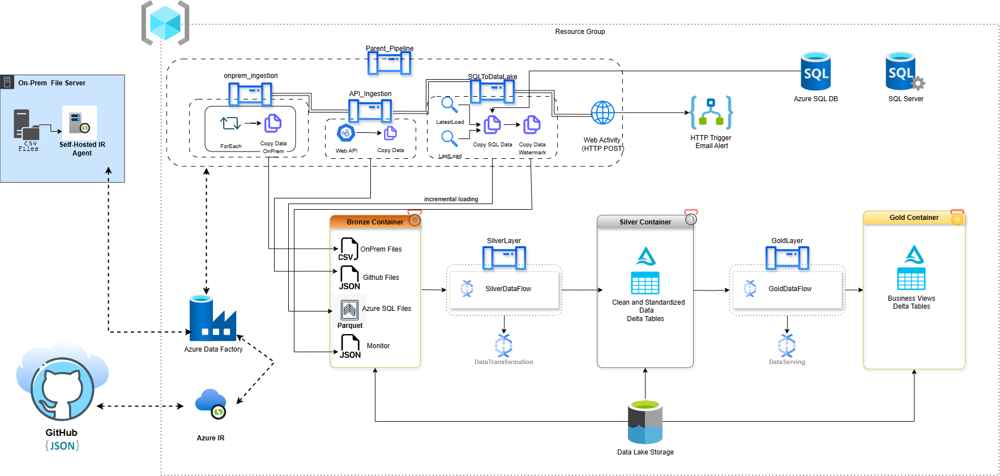
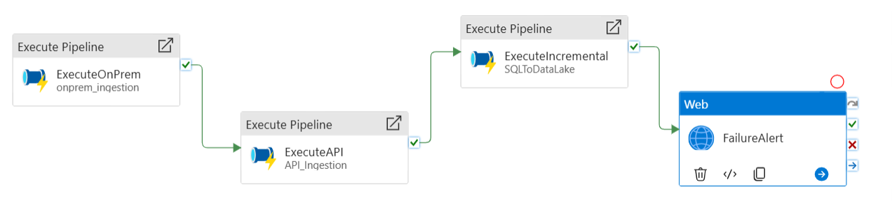
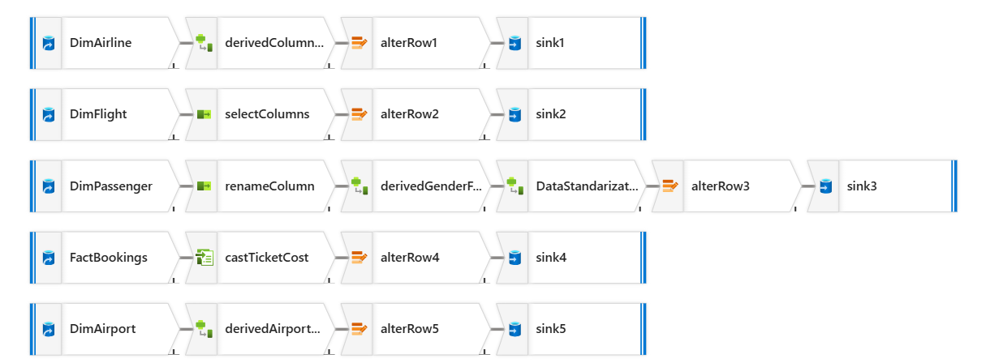
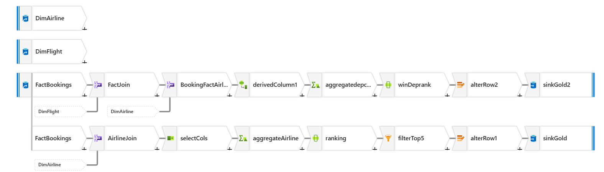

# Azure Data Engineering Project with Azure Data Factory

## 📌 Overview
This project demonstrates the design and implementation of a **modern data engineering pipeline** using **Azure Data Factory (ADF)**, **Azure Data Lake Storage Gen2 (ADLS)**, and **Azure SQL Database**.  

The pipeline ingests data from **multiple heterogeneous sources** (on-premises file system, GitHub API, and Azure SQL Database), organizes them into the **Bronze-Silver-Gold architecture**, and finally exposes **business-ready datasets** for analytics.  

It also includes **incremental loading with watermarking** and **failure alerting** through **Logic Apps**.

---

## Architecture

**Key components:**
- **On-Prem File Server** (CSV files) – accessed via **Self-Hosted Integration Runtime (SHIR)**.  
- **GitHub (HTTP/JSON)** – ingested via ADF HTTP Linked Service.  
- **Azure SQL Database** (FactBookings table) – ingested incrementally with watermark.  
- **Azure Data Lake Storage Gen2** – used as the **data lake**, structured into **Bronze, Silver, Gold** containers.  
- **Azure Data Factory** – orchestration tool for data ingestion and transformation pipelines.  
- **Logic Apps** – triggered via Web Activity in ADF to send **failure alerts** (email).  

---

## 📂 Data Lake Zones
- **Bronze (Raw Layer):**
  - OnPrem CSV files (`DimPassenger.csv`, `DimAirline.csv`, `DimFlight.csv`)  
  - GitHub JSON file (`DimAirport.json`)  
  - Azure SQL incremental extract (`FactBookings.parquet`)  
  - Monitor folder (watermark JSON)  

- **Silver (Clean Layer):**
  - Data after cleaning, standardization, and type conversion  
  - Stored in **Delta format** (`silver/DimPassenger`, `silver/DimAirline`, `silver/DimFlight`, `silver/DimAirport`, `silver/FactBookings`)  

- **Gold (Business Layer):**
  - Business-ready Delta tables (e.g. Top 5 Airlines by Sales, Peak Departure Hours per Country)  
  - Stored in `gold/BusinessView/`  

---

## Pipelines and Flows
### 1. **OnPrem Ingestion (`onprem_ingestion`)**
- **Source:** CSV files from On-Prem File System (via SHIR).  
- **Sink:** ADLS Gen2 → `bronze/onprem/*.csv`.  
- **Logic:**  
  - Uses a **ForEach** loop over a list of filenames.  
  - **Copy Activity** moves each file.  
  - **Dynamic column mapping** handled via pipeline parameters (`p_mapping_flight`, `p_mapping_passenger`, `p_mapping_airline`).  

---

### 2. **API Ingestion (`API_Ingestion`)**
- **Source:** JSON file hosted on GitHub (via HTTP Linked Service).  
- **Sink:** ADLS Gen2 → `bronze/github/DimAirport.json`.  
- **Steps:**  
  - `WebAPIcall` – validates the endpoint.  
  - `CopyAPIdata` – copies JSON into Data Lake.  

---

### 3. **Incremental Ingestion (`SQLToDataLake`)**
- **Source:** Azure SQL Database (`FactBookings` table).  
- **Sink:** ADLS Gen2 → `bronze/sql/*.parquet`.  
- **Logic:**  
  1. `LastLoad` (Lookup) – reads watermark (`lastload.json`).  
  2. `LatestLoad` (Lookup) – queries MAX(booking_date) from SQL DB.  
  3. `CopySQLData` – copies only incremental records between `LastLoad` and `LatestLoad`.  
  4. `watermark` – updates `lastload.json` with new value.  

---

### 4. **Parent Pipeline (`ParentPipeline`)**

- Orchestrates the 3 ingestion pipelines:  
  1. ExecuteOnPrem → `onprem_ingestion`  
  2. ExecuteAPI → `API_Ingestion`  
  3. ExecuteIncremental → `SQLToDataLake`  
- Runs them **sequentially** with dependency conditions (`Succeeded`).  
- Includes `FailureAlert` (Web Activity) → triggers Logic App to send email if ingestion fails.  

---

### 5. **Silver Layer (`SilverLayer`)**

- **Data Flow:** `DataTransformation`  
- **Sources:** Bronze data (CSV, JSON, Parquet).  
- **Transformations:**  
  - Capitalize country names (DimAirline).  
  - Rename columns (DimFlight, DimPassenger).  
  - Standardize gender and country (DimPassenger).  
  - Convert types (FactBookings).  
  - Uppercase column (DimAirport).  
- **Sinks:** Writes **Delta tables** to `silver/*` with **upsert enabled**.  

---

### 6. **Gold Layer (`GoldLayer`)**

- **Data Flow:** `DataServing`  
- **Sources:** Delta tables from `silver/*`.  
- **Transformations (Business Views):**
  - **Top 5 Airlines by Total Sales**  
    - Join FactBookings ↔ DimAirline, aggregate by `sum(ticket_cost)`, rank, filter Top 5.  
  - **Peak Departure Hours by Country**  
    - Join FactBookings ↔ DimFlight ↔ DimAirline, derive departure/arrival hour, aggregate by (country, dep_hour), rank.  
- **Sinks:** Delta tables in `gold/BusinessView/`.  

---

##  Failure Handling
- If a pipeline activity fails, ADF calls **Logic App** using **Web Activity** (`POST`).  
- Logic App sends an **email alert** with pipeline name, run ID, activity status, and error message.  

---

## Technologies Used
- **Azure Data Factory** – Orchestration & Data Pipelines  
- **Azure Data Lake Storage Gen2** – Storage (Bronze, Silver, Gold zones)  
- **Azure SQL Database** – Source for incremental data ingestion  
- **Self-Hosted Integration Runtime (SHIR)** – To access On-Prem files  
- **Azure Logic Apps** – Email alerts on pipeline failure  
- **GitHub** – Source of JSON file (simulating API ingestion)  
- **Delta Lake Format** – Storage format for Silver & Gold layers  

---
